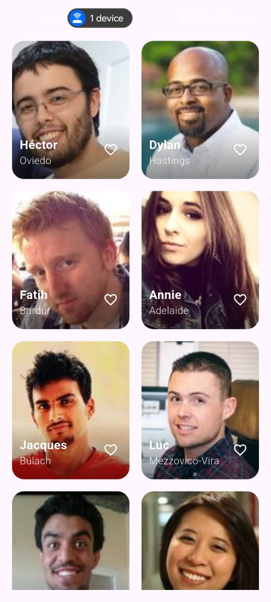

# Profile Explorer

A sleek and animated profile browsing application built with Flutter. This project demonstrates modern app development techniques including BLoC for state management, smooth Hero animations, and custom UI transitions.

## Screenshots

| Grid View | Detail View |
| :---: | :---: |
|  |  |

## Features

- **Dynamic Profile Grid**: Fetches and displays a list of user profiles in a responsive grid.
- **Skeleton Loading**: Shows an elegant skeleton loading UI while fetching data, providing a better user experience.
- **Detailed Profile View**: Tap on any profile to navigate to a detailed view with a beautiful Hero animation for the profile image.
- **Smooth Animations**: The details container slides and fades in gracefully after the page transition is complete.
- **Stateful "Like" System**: Users can "like" or "favorite" profiles. This state is managed globally using the BLoC pattern.
- **Consistent State**: The "like" status is consistently reflected across both the main grid and the detail screen.

## Tech Stack & Architecture

This project utilizes a modern and scalable tech stack, centered around clean architecture principles.

- **Framework**: [Flutter](https://flutter.dev/)
- **State Management**: [flutter_bloc](https://pub.dev/packages/flutter_bloc) for predictable and scalable state management.
- **Data Fetching**: [http](https://pub.dev/packages/http) for making network requests to fetch profile data.
- **Value Equality**: [equatable](https://pub.dev/packages/equatable) to simplify BLoC state and event comparisons.
- **UI & Animations**:
  - **Skeletonizer**: For creating beautiful and automatic loading skeletons.
  - **Hero Widget**: For creating seamless hero transitions between screens.
  - **AnimationController**: For custom slide and fade animations.

### Project Structure

The project follows a feature-first directory structure to keep the codebase organized and modular.

```
lib/
└── features/
    └── profile_explorer/
        ├── bloc/         # BLoC (Events, States, Bloc)
        ├── model/        # Data models (UserProfile)
        ├── repository/   # Data fetching and business logic
        └── view/         # UI (Screens and Widgets)
            └── widgets/
app.dart
main.dart                 # App entry point
```

## Getting Started

To get a local copy up and running, follow these simple steps.

### Prerequisites

Make sure you have the Flutter SDK installed on your machine.
- [Flutter Installation Guide](https://docs.flutter.dev/get-started/install)

### Installation

1.  **Clone the repository**
    ```sh
    git clone https://github.com/your-username/profile_explorer.git
    ```
2.  **Navigate to the project directory**
    ```sh
    cd profile_explorer
    ```
3.  **Install dependencies**
    ```sh
    flutter pub get
    ```

### Running the App

1.  **Connect a device** (or start an emulator/simulator).

2.  **Run the app** from your terminal:
    ```sh
    flutter run
    ```

---

